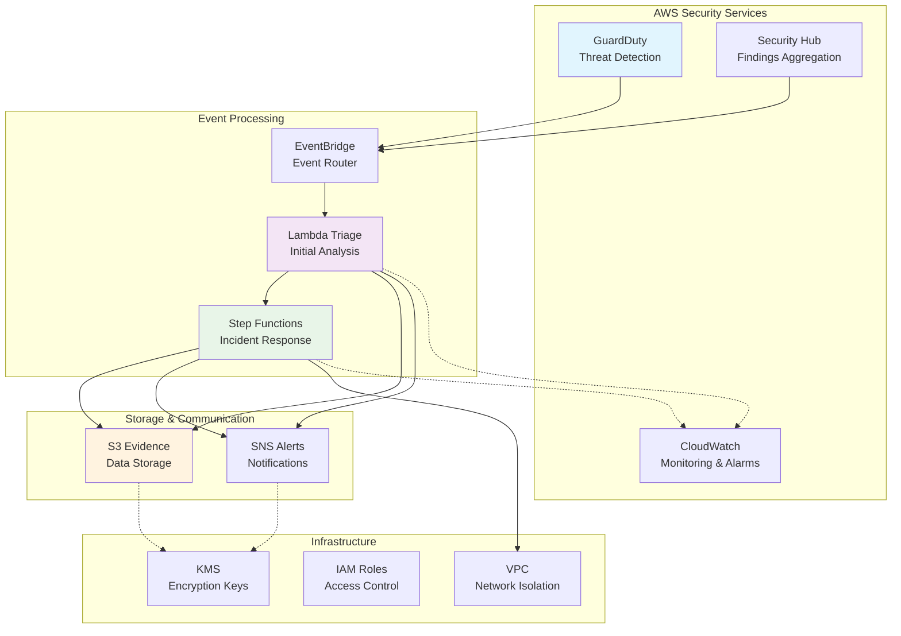
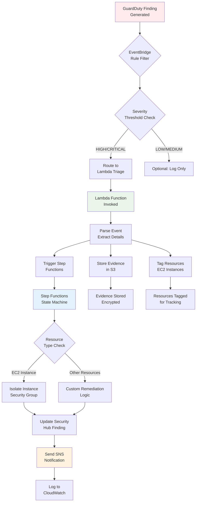
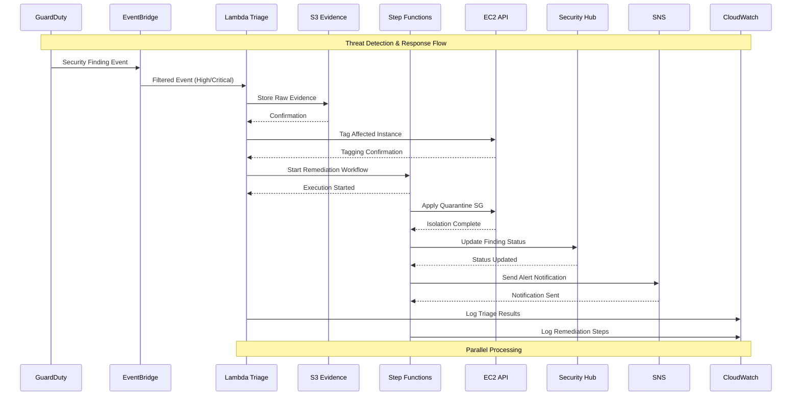
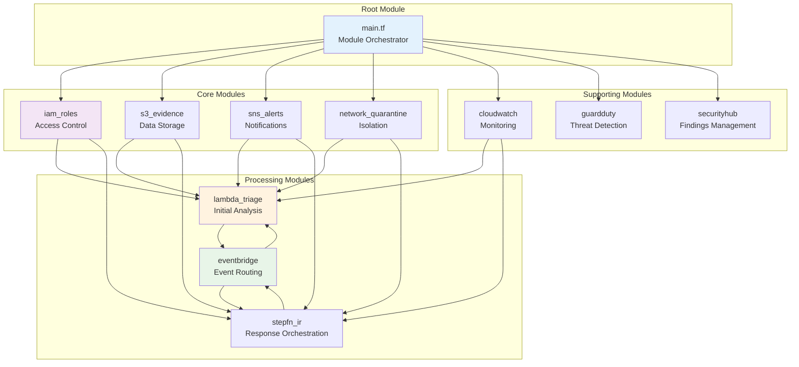
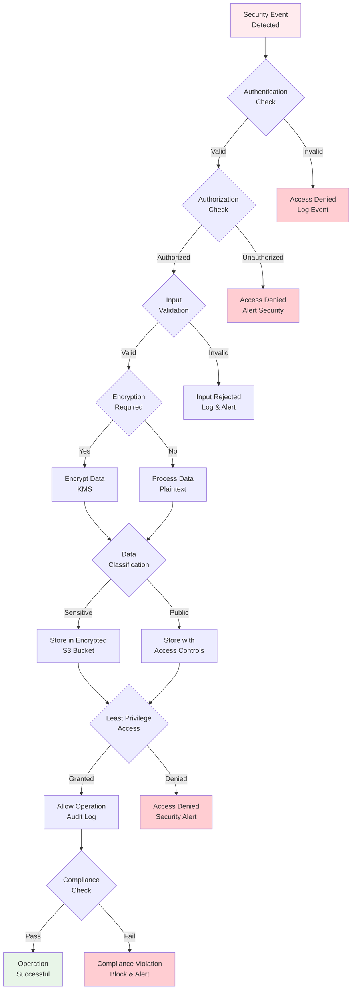
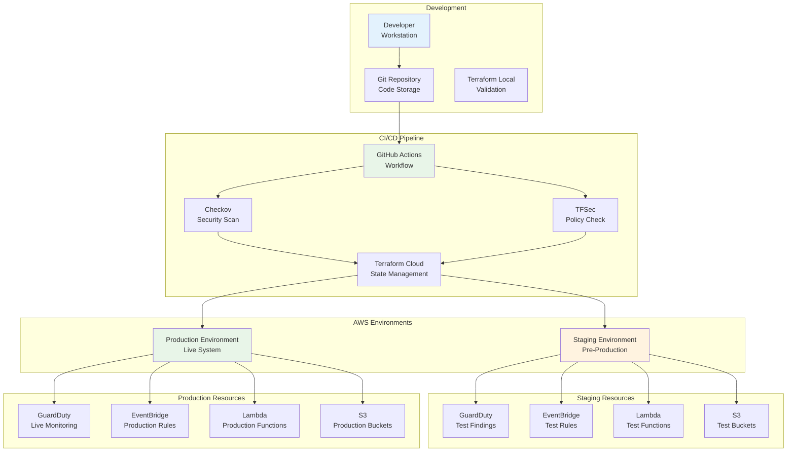
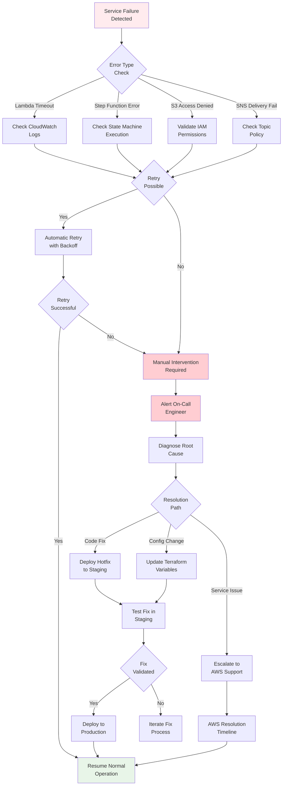
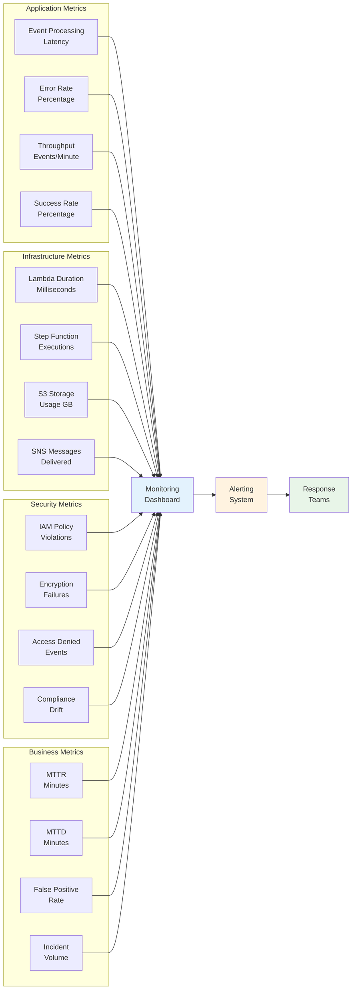

# Architecture Diagrams: AWS Threat Detection & Incident Response Stack

**Version:** 1.0.0
**Last Updated:** 2025-08-30
**Diagram Tool:** Mermaid

## 📋 Table of Contents

1. [High-Level Architecture](#high-level-architecture)
2. [Data Flow Diagram](#data-flow-diagram)
3. [Service Interaction Flow](#service-interaction-flow)
4. [Module Dependency Graph](#module-dependency-graph)
5. [Event-Driven Processing Flow](#event-driven-processing-flow)
6. [Security Control Flow](#security-control-flow)
7. [Deployment Architecture](#deployment-architecture)
8. [Failure Recovery Flow](#failure-recovery-flow)

---

## 🏗️ High-Level Architecture



**Key Components:**
- **GuardDuty**: AWS threat detection service
- **Security Hub**: Centralized security findings
- **EventBridge**: Event routing and filtering
- **Lambda**: Serverless compute for triage
- **Step Functions**: Orchestrated incident response
- **S3**: Evidence storage with encryption
- **SNS**: Alert notifications
- **CloudWatch**: Monitoring and logging

---

## 🔄 Data Flow Diagram



**Data Flow Explanation:**
1. **Threat Detection**: GuardDuty generates findings
2. **Event Filtering**: EventBridge filters by severity
3. **Initial Triage**: Lambda parses and enriches data
4. **Evidence Storage**: Raw events stored in encrypted S3
5. **Resource Tagging**: Affected resources tagged for tracking
6. **Incident Response**: Step Functions orchestrate remediation
7. **Status Updates**: Security Hub findings updated
8. **Notifications**: Stakeholders alerted via SNS
9. **Monitoring**: All activities logged to CloudWatch

---

## 🔗 Service Interaction Flow



**Interaction Details:**
- **Synchronous**: EventBridge → Lambda (immediate processing)
- **Asynchronous**: Lambda → Step Functions (workflow orchestration)
- **Parallel**: Multiple services can process simultaneously
- **Idempotent**: Operations designed to be safe for retries

---

## 📦 Module Dependency Graph



**Dependency Relationships:**
- **Hard Dependencies**: IAM roles required by compute resources
- **Soft Dependencies**: Services can operate independently
- **Circular Dependencies**: EventBridge ↔ Lambda/Step Functions (needs resolution)
- **Optional Dependencies**: CloudWatch monitoring can be disabled

---

## ⚡ Event-Driven Processing Flow

```mermaid
stateDiagram-v2
    [*] --> ThreatDetected
    ThreatDetected --> EventBridgeFilter: GuardDuty Finding

    state EventBridgeFilter as "EventBridge Rule"
        [*] --> SeverityCheck
        SeverityCheck --> HighSeverity: HIGH/CRITICAL
        SeverityCheck --> LogOnly: LOW/MEDIUM
        HighSeverity --> [*]
        LogOnly --> [*]
    end

    EventBridgeFilter --> LambdaTriage: High Severity Event

    state LambdaTriage as "Lambda Triage Function"
        [*] --> ParseEvent
        ParseEvent --> StoreEvidence: Extract Details
        StoreEvidence --> TagResources: Identify Assets
        TagResources --> TriggerWorkflow: Start Remediation
        TriggerWorkflow --> [*]
    end

    LambdaTriage --> StepFunctions: Remediation Request

    state StepFunctions as "Step Functions State Machine"
        [*] --> AssessImpact
        AssessImpact --> IsolateResource: EC2 Instance
        AssessImpact --> CustomAction: Other Resources
        IsolateResource --> UpdateFinding
        CustomAction --> UpdateFinding
        UpdateFinding --> SendNotification
        SendNotification --> [*]
    end

    StepFunctions --> SecurityHub: Status Update
    StepFunctions --> SNS: Alert Notification
    LambdaTriage --> CloudWatch: Processing Logs

    ThreatDetected --> CloudWatch: Raw Events
    StepFunctions --> CloudWatch: Remediation Logs

    style ThreatDetected fill:#ffebee
    style LambdaTriage fill:#e8f5e8
    style StepFunctions fill:#e3f2fd
```

**State Transitions:**
1. **Detection**: GuardDuty identifies threats
2. **Filtering**: EventBridge applies severity rules
3. **Triage**: Lambda performs initial analysis
4. **Response**: Step Functions orchestrates remediation
5. **Notification**: Stakeholders alerted of actions
6. **Logging**: All activities recorded for audit

---

## 🔒 Security Control Flow



**Security Layers:**
1. **Authentication**: Verify request origin
2. **Authorization**: Check permissions
3. **Input Validation**: Sanitize data
4. **Encryption**: Protect data at rest/transit
5. **Access Control**: Least privilege enforcement
6. **Compliance**: Regulatory requirement validation
7. **Auditing**: All actions logged and monitored

---

## 🚀 Deployment Architecture



**Deployment Flow:**
1. **Development**: Local testing and validation
2. **CI/CD**: Automated security scanning and testing
3. **Staging**: Pre-production validation
4. **Production**: Live deployment with monitoring

---

## 🔄 Failure Recovery Flow



**Recovery Mechanisms:**
1. **Automatic Retries**: Exponential backoff for transient failures
2. **Circuit Breakers**: Prevent cascade failures
3. **Manual Intervention**: Complex issues require human analysis
4. **Rollback Procedures**: Quick reversion to stable state
5. **Monitoring Integration**: Proactive failure detection

---

## 📊 Metrics & Monitoring Dashboard



**Dashboard Components:**
- **Real-time Metrics**: Current system health
- **Historical Trends**: Performance over time
- **Alert Thresholds**: Automated notifications
- **Incident Correlation**: Related event analysis

---

## 🎯 Key Insights from Diagrams

### Architecture Strengths
1. **Event-Driven Design**: Loose coupling between services
2. **Serverless First**: Cost-effective and scalable
3. **Defense in Depth**: Multiple security layers
4. **Observability**: Comprehensive monitoring integration

### Potential Improvements
1. **Circuit Breakers**: Add between services for resilience
2. **Event Sourcing**: Store all events for audit trails
3. **Multi-Region**: Cross-region replication for DR
4. **Auto-Scaling**: Dynamic resource allocation

### Operational Considerations
1. **Cost Monitoring**: Serverless can scale unexpectedly
2. **Cold Starts**: Lambda initialization delays
3. **Event Ordering**: Ensure sequential processing when needed
4. **Rate Limiting**: Protect against event storms

---

## 📖 Usage Examples

### Normal Operation Flow
```
GuardDuty Finding → EventBridge → Lambda Triage → Step Functions → Resolution
```

### Error Recovery Flow
```
Service Failure → CloudWatch Alarm → SNS Alert → On-Call Response → Investigation → Fix → Deployment
```

### Security Incident Flow
```
Threat Detected → Automated Response → Manual Verification → Incident Closure → Post-Mortem
```

These diagrams provide a comprehensive view of the AWS threat detection and incident response stack, showing how each component interacts and contributes to the overall security posture.