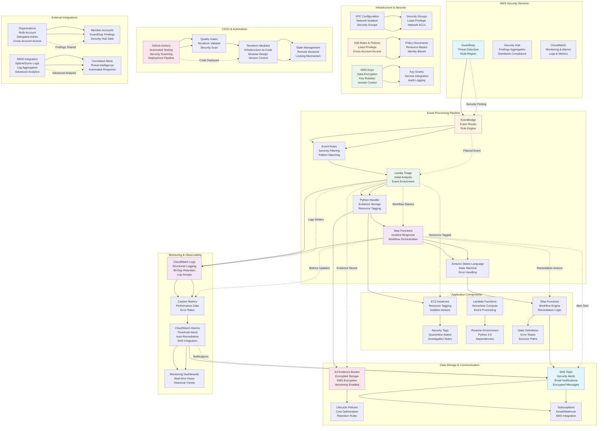

# AWS Threat Detection & Incident Response - Application/Services Flow

## Architecture Flow Description

### 1. **Security Detection Layer**
- **GuardDuty**: AWS native threat detection service monitoring for malicious activity
- **Security Hub**: Centralized security findings aggregation and compliance monitoring
- **CloudWatch**: Comprehensive monitoring, logging, and alerting infrastructure

### 2. **Event Processing Pipeline**
- **EventBridge**: Serverless event router with rule-based filtering and transformation
- **Lambda Triage**: Initial analysis and enrichment of security events
- **Step Functions**: Orchestrated incident response workflows with error handling

### 3. **Data Management Layer**
- **S3 Evidence**: Encrypted storage for security event data and investigation artifacts
- **SNS Alerts**: Multi-channel notification system for security incidents
- **KMS**: Key management service for data encryption and access control

### 4. **Infrastructure Security**
- **VPC Configuration**: Network isolation and security group management
- **IAM Roles**: Least-privilege access control with cross-account capabilities
- **Resource Tagging**: Automated tagging of affected resources for tracking

### 5. **Application Components**
- **EC2 Instance Management**: Automated isolation and quarantine of compromised resources
- **Lambda Runtime**: Serverless compute environment for event processing
- **Step Functions States**: Workflow definitions for incident response procedures

### 6. **Monitoring & Observability**
- **CloudWatch Logs**: Structured logging with 90-day retention for compliance
- **Custom Metrics**: Performance and security metrics collection
- **Alerting System**: Automated notifications based on configurable thresholds

### 7. **CI/CD Automation**
- **GitHub Actions**: Automated testing, security scanning, and deployment
- **Terraform Modules**: Infrastructure as code with modular, reusable components
- **Quality Gates**: Automated validation and security checks

### 8. **External Integrations**
- **AWS Organizations**: Multi-account security management and delegated administration
- **SIEM Integration**: Advanced threat analysis and correlation with external tools

## Event Processing Flow

### **Normal Operation Flow**
1. **Threat Detection**: GuardDuty identifies suspicious activity
2. **Event Routing**: EventBridge filters and routes findings based on severity
3. **Initial Triage**: Lambda function parses, enriches, and stores evidence
4. **Resource Tagging**: Affected EC2 instances are tagged for tracking
5. **Workflow Trigger**: Step Functions orchestrates remediation actions
6. **Isolation**: Compromised resources are isolated using security groups
7. **Notification**: Stakeholders are alerted via SNS
8. **Logging**: All actions are logged to CloudWatch for audit

### **Error Handling Flow**
1. **Failure Detection**: CloudWatch alarms detect processing failures
2. **Retry Logic**: Automatic retries with exponential backoff
3. **Dead Letter Queue**: Failed events sent to DLQ for manual review
4. **Alert Generation**: Operations team notified of processing issues
5. **Manual Intervention**: Complex failures require human analysis
6. **Recovery**: Failed workflows restarted with corrected parameters

## Security Control Flow

### **Authentication & Authorization**
1. **IAM Roles**: Service-specific roles with least privilege permissions
2. **Resource Policies**: S3 bucket policies and KMS key grants
3. **Cross-Account Access**: Organizations integration for multi-account scenarios

### **Data Protection**
1. **Encryption at Rest**: All data encrypted using KMS customer-managed keys
2. **Encryption in Transit**: TLS 1.2+ for all communications
3. **Key Rotation**: Automatic KMS key rotation every 365 days

### **Network Security**
1. **VPC Isolation**: Resources deployed in isolated VPC environments
2. **Security Groups**: Least privilege network access rules
3. **Network ACLs**: Additional layer of network traffic control

### **Monitoring & Auditing**
1. **CloudWatch Logs**: Comprehensive audit logging of all actions
2. **Security Hub**: Compliance monitoring and findings aggregation
3. **Config Rules**: Automated compliance checking and remediation

## Deployment Architecture

### **Single Account Deployment**
- All components deployed in a single AWS account
- Simplified networking and IAM configuration
- Suitable for smaller organizations or development environments

### **Multi-Account (Organizations) Deployment**
- Security services deployed in dedicated security account
- Application accounts share findings via Organizations
- Delegated administration for centralized management
- Cross-account IAM roles for service integration

## Performance Considerations

### **Scalability**
- **EventBridge**: Handles thousands of events per second
- **Lambda**: Auto-scaling based on concurrent executions
- **Step Functions**: Parallel execution of remediation tasks
- **S3**: Virtually unlimited storage capacity

### **Reliability**
- **Multi-AZ Deployment**: Resources distributed across availability zones
- **Automatic Failover**: Built-in redundancy for critical components
- **Circuit Breakers**: Prevent cascade failures during service outages

### **Cost Optimization**
- **Serverless Architecture**: Pay-per-use pricing model
- **Resource Tagging**: Cost allocation and optimization
- **Lifecycle Policies**: Automated cleanup of old evidence data

## Compliance & Security Standards

### **Supported Frameworks**
- **CIS AWS Foundations**: Security best practices benchmark
- **NIST 800-53**: Federal information security controls
- **SOC 2**: Security, availability, and confidentiality
- **GDPR**: Data protection and privacy requirements
- **HIPAA**: Healthcare data compliance (with additional controls)

### **Audit & Compliance Features**
- **Immutable Logs**: CloudWatch logs cannot be modified or deleted
- **Evidence Preservation**: S3 object lock for compliance data
- **Access Auditing**: Detailed logging of all resource access
- **Compliance Reporting**: Automated compliance status reporting

This diagram illustrates the complete application and service flow for the AWS threat detection and incident response stack, showing how security events are processed from detection through remediation while maintaining comprehensive monitoring, compliance, and audit capabilities.